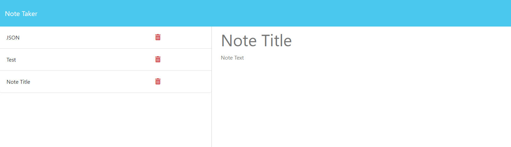

# Note Taker#
A program which records notes entered into the Title and Text Fields

## Description
Uses Express JS to read and write data to a database. Front end user interface makes api requests to the server backend which sends information back.

## Installation
Run  'npm i'  to install dependencies.

## Usage
Input 'npm start'  to initiate the program.

Link to Deployed program.

https://floating-hamlet-15376-a415bce60b61.herokuapp.com/

=======

## Credits
Starter code provided by Bootcamp lessons.
 
## License
MIT
